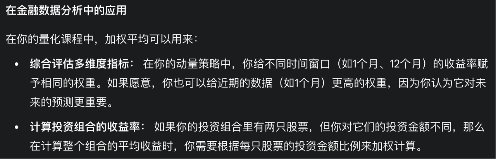
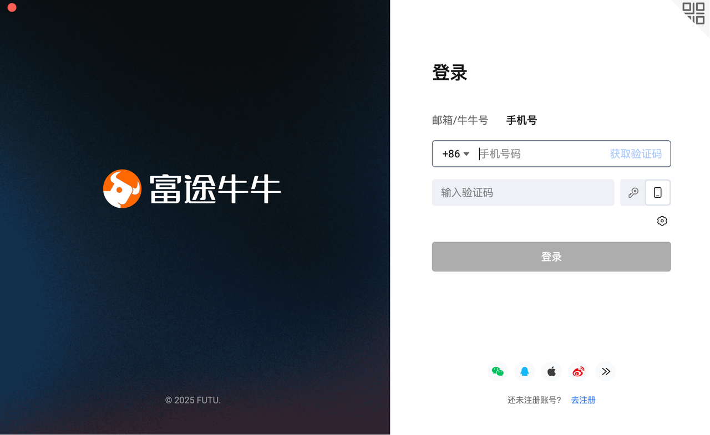

# Background 

- [How does the stock market work? - Oliver Elfenbaum ](https://www.youtube.com/watch?v=p7HKvqRI_Bo)
- [Explained | The Stock Market | FULL EPISODE | Netflix](https://www.youtube.com/watch?v=ZCFkWDdmXG8&t=829s)

# **第一周主题：解码英伟达（NVDA）的暴涨之谜**

## **课程设计目的**

这个课程的目标通过一个具体的案例——英伟达，引导同学们理解以下核心观点：

- **长期趋势取决于产品力与行业大势：** 一家公司的股价能否长期上涨，不是因为几次财报数据的好坏，而是因为它是否拥有颠覆性的技术，能解决行业痛点，并引领未来的发展。
- **短期波动受事件驱动：** 财报、新闻、地缘政治等事件会引起股价的剧烈波动，但这只是“小浪花”。
- **数据分析****是理解世界的工具：** 通过数据分析，我们可以用数字和图表来验证和量化上述观点，将抽象的故事变成可信的结论。

## **任务一：获取英伟达的股票数据（2020-2025）**

**设计目的： 引入长期视角，为后续分析打下基础。让同学们学会如何获取真实世界的数据，这是****数据分析****的第一步。 这个任务是整个分析的基石。选择五年这个时间跨度至关重要，它确保我们能够看到一个完整的商业周期，而不是被短期事件的噪音所干扰。如果没有长期数据，我们无法区分股价的长期趋势还是短期的随机波动。**

**背后概念：**

- **股票数据：** 股票就像一个公司的“份额”，你在股票市场买卖的就是这些份额。股票数据记录了每天这些份额的交易情况，比如开盘时的价格、当天的最高价、最低价和收盘时的价格。
- **英伟达（NVIDIA）：** 一家全球知名的科技公司，主要设计和制造图形处理器（GPU）。它的股价波动很大，是很好的学习案例。
- **`yfinance`****：**  yfinance 在获取美股数据方面表现最佳，支持获取股票、期权、加密货币等数据。它也支持其他国家（如印度、英国、日本等）的主要股票数据 。 https://github.com/ranaroussi/yfinance


**具体操作：**

1. **AI** **辅助：** 指导学生使用 `yfinance` 库，向 AI 发出指令。
   1. **提示词：** “写一段 Python 代码，使用 `yfinance` 库获取并保存英伟达（股票代码：NVDA）从2020年1月1日到2025年8月26日的股票历史数据，并将保存的数据的前5行打印出来，以便我确认数据格式，并解释这些数据含义，注意数据保存成CSV格式的文件。”
2. **数据探索：** 学生将看到日期、开盘价、最高价、最低价、收盘价和成交量等列。老师引导学生思考：这些数据能告诉我们一家公司的哪些信息？

**安装依赖库**

```Plain
pip install yfinance pandas
```

> 同学们需要与Cline互动，如授权Cline执行命令“Run Command”，直至生成`get_nvda_stock_data.py`和`NVDA_stock_data_2020_2025.csv`文件。

**运行结果：**

```
已成功完成NVDA股票数据获取任务。以下是详细结果：

生成的文件
1. Python脚本: get_nvda_stock_data.py - 包含获取和保存股票数据的完整代码
2. CSV数据文件: NVDA_stock_data_2020_2025.csv - 包含英伟达从2020年1月2日到2025年8月25日的完整股票历史数据
  
数据统计信息
- 时间范围: 2020-01-02 到 2025-08-25
- 总交易日数: 1419天
- 收盘价范围: $4.89 - $183.16
- 数据列数: 7列
  
CSV文件格式
CSV文件包含以下列：
- Date: 交易日期（带时区信息）
- Open: 开盘价（美元）
- High: 最高价（美元）
- Low: 最低价（美元）
- Close: 收盘价（美元）
- Volume: 成交量（股数）
- Dividends: 股息支付（美元）
- Stock Splits: 股票分割比例
  
数据含义解释
前5行数据展示了英伟达在2020年初的交易情况：
1. 2020-01-02: 开盘$5.94，最高$5.97，最低$5.89，收盘$5.97，成交量2.38亿股
2. 2020-01-03: 开盘$5.85，最高$5.92，最低$5.83，收盘$5.88，成交量2.05亿股
3. 2020-01-06: 开盘$5.78，最高$5.91，最低$5.76，收盘$5.90，成交量2.63亿股
4. 2020-01-07: 开盘$5.93，最高$6.02，最低$5.88，收盘$5.97，成交量3.15亿股
5. 2020-01-08: 开盘$5.97，最高$6.02，最低$5.93，收盘$5.98，成交量2.77亿股

这些数据可用于后续的量化交易分析，包括趋势分析、技术指标计算、回测策略开发等。
```


附件1：获取英伟达日交易数据的python脚本（由AI生成）

[get_nvda_stock_data.py](code/get_nvda_stock_data.py)

```Shell
# 执行以下脚本，将得到如下数据文件NVDA_stock_data_2020_2025.csv
python get_nvda_stock_data.py
```

附件2：英伟达日交易数据

[NVDA_stock_data_2020_2025.csv](data/NVDA_stock_data_2020_2025.csv)

**课堂互动环节：** 

1、请一位同学懂编程的同学code review上述AI写的代码？并提出改进意见？

2、请一位同学尝试解读Cline是如何生成这些代码？就像普通程序员写代码会有bug，AI写出来的代码也有bug，Cline是如何该bug的？**（工作原理：代码生成-调试验证-修复问题 的不断迭代，并且完全自动化）**

补充：

1、相同的prompt输入，cline、deepseek分别的输出

2、cline 完成**代码生成-调试验证-修复问题 这几个环节的过程**

3、COT是否配置？cline的高级配置

**结论观点：**

- 股价的变动不是随机的，而是有规律可循。
- 只有使用足够长的数据时间跨度，我们才能看到股价的真实长期趋势。

## **任务二：计算每日收益率及波动率情况**

**设计目的：该任务基于`任务一`获取到的交易数据，将抽象的股价变化量化为具体的指标。我们以收益率和波动率作为最基本的指标为例，收益率回答了“我们赚了多少”，而波动率则量化了“我们承担了多大风险”。这是理解所有股票分析的核心。**

**相关概念：**


- **标准差（Standard Deviation）：** 一个统计学工具，用来衡量一组数据（这里是每日收益率）的分散程度。标准差越大，数据越分散，股票的波动就越剧烈。


- **波动率：** 衡量股票价格“上蹿下跳”的程度。波动率高，就像坐过山车，刺激但风险大；波动率低，就像坐地铁，平稳但无聊。


**具体操作：**

1. **AI 辅助：** 指导学生计算每日收益率和波动率。
   1. **提示词：** “基于获得的交易数据`NVDA_stock_data_2020_2025.csv`文件， 编写 Python 代码，绘制累计收益趋势图，计算每日收益率，并找到排名前十的收益率最大和最小的日期。然后，计算英伟达这五年的年化收益率和年化波动率。”
2. **数据分析：** 学生将看到收益率的峰值和谷值，以及具体的波动率数值。老师引导学生思考：这些极端日期的数值如此之大，背后一定有强大的驱动力。

**运行结果：**

已成功完成NVDA股票数据分析任务。以下是主要分析结果：
```
主要发现：

1. 累计收益率表现

NVDA股票在2020-2025年期间表现出色，总收益率达到2911.01%
年化收益率高达83.14%，显示出极强的增长性

2. 波动性分析

年化波动率为54.12%，表明股票具有较高的波动性
夏普比率为1.54（假设无风险收益率为0），显示较好的风险调整后收益

3. 收益率极值分析

收益率最大的前十日期：

1. 2023-05-25: +24.37% (收盘价: $37.95)
2. 2025-04-09: +18.72% (收盘价: $114.32)
3. 2020-03-24: +17.16% (收盘价: $6.21)

收益率最小的前十日期：
2020-03-16: -18.45% (收盘价: $4.89)
2025-01-27: -16.97% (收盘价: $118.40)
2020-03-12: -12.24% (收盘价: $5.39)

4. 生成的文件

nvda_cumulative_returns.png: 累计收益趋势图
nvda_daily_returns_distribution.png: 每日收益率分布图
nvda_analysis_results.csv: 完整的分析数据结果

5. 数据统计

总交易日数: 1418天
时间范围: 2020-01-02 到 2025-08-25

分析结果显示NVDA在这五年间表现出极高的增长性和波动性，特别是在AI芯片需求爆发的背景下，股价实现了显著增长，但也伴随着较大的价格波动。
```


- 互动1：根据累计收益图，你能发现什么？

参考：股价起飞是在2023年以后（ChatGPT开启了一个全新的AI时代）


- 互动2：根据每日收益率分布，你又能发现什么？

参考：收益率围绕均值0.30%呈现正态分布，绝大部分集中在1个标准差内，暴涨、暴跌为小概率事件！

- 互动3（扩展问题）：对于波动率更小的股票，你认为收益率分布图是 更扁平 还是 更瘦长？

参考：更瘦长，对比可可可乐（在任务四我们将重点对比二者），其波动率更小，所以分布图更瘦长。


附件1：AI生成的代码

[nvda_stock_analysis.py](code/nvda_stock_analysis.py)

附件2：根据收盘价计算的每日收益率和累计收益率

[nvda_analysis_results.csv](data/nvda_analysis_results.csv)

**结论观点：**

- 股价的短期变化非常剧烈，伴随着高风险。
- 日常的涨跌只是市场的“噪音”，需要更深入的分析才能找到其背后的原因。

## **任务三：数据与事件的交叉验证**

**设计目的：该任务是整个课程的“侦探”环节。它将基于****`任务二`****发现的单日涨跌幅最大的交易日，如何与现实世界中的重大新闻事件联系起来，证明短期波动确实是由可追溯的事件所驱动。**

**具体操作：**

1. **AI 辅助：** 指导学生进行事件回溯。
   1. **提示词：** “英伟达在2023-05-25股价大涨，查找该日期前后有哪些关于其新产品发布或财报发布的重大新闻？”
2. **分析与讨论：** 学生们会发现，这些极端日期的背后往往是财报超预期、地缘政治紧张、或者关键技术突破等新闻。

**运行结果：**

- **提示词：** “英伟达在2023-05-25股价大涨，查找该日期前后有哪些关于其新产品发布或财报发布的重大新闻？”
```
我已经完成了对英伟达2023-05-25股价大涨前后重大新闻事件的分析。主要发现如下：

## 关键发现

**2023-05-25股价表现**：

- 单日涨幅24.37%，创英伟达历史最高单日涨幅记录
- 股价从30.52美元涨至37.95美元
- 市值单日增加约2000亿美元
  - 

## 主要驱动事件

1. **2023-05-24财报发布**：（相关性最大）
   1. 2024财年Q1营收71.9亿美元，远超预期的65.2亿美元
   2. 数据中心业务营收创历史纪录
   3. 给出Q2营收110亿美元的强劲指引
      - 
2. **2023-05-28 COMPUTEX 2023**：
   1. 发布新一代AI芯片和平台
   2. 宣布与微软、谷歌、Oracle的云合作伙伴关系
      - 
3. **AI热潮推动**：
   1. ChatGPT等生成式AI应用爆发
   2. 数据中心GPU需求急剧上升
      - 

## 其他重要因素

- 多家投行大幅上调目标价和评级
- 分析师看好AI芯片长期需求前景
- 新产品包括DGX H100 AI超级计算机和NVIDIA AI Enterprise更新

分析结果已保存为详细报告文件 `nvda_2023_analysis_summary.md`，包含完整的时间线、驱动因素分析和市场影响评估。
```

附件1: 2023-05-25股价大涨的分析报告

[nvda_2023_analysis_summary.md](md/nvda_2023_analysis_summary.md)

附件2: 获取2023-05-25前后英伟达新闻事件的代码（由AI生成）

[find_nvda_news_2023.py](code/find_nvda_news_2023.py)

**结论观点：**

- 财报、新闻和地缘政治事件是影响股价短期波动的重要因素。
- 这些“小浪花”虽然能带来短期的巨额回报或亏损，但它们并不能决定股价的长期趋势。

**课堂互动环节：** 

- 分析下2025-01-27股价大跌背后的原因

**提示词：** “英伟达在2025-01-27股价大跌，查找该日期前后，有哪些可能影响科技股的地缘政治事件或行业政策变动？”

由于Cline+deepseek并不擅长对新闻事件等外部网页的搜索总结，建议deepseek和chatgpt网页端进行交叉验证。

- Deepseek网页端给出的时间线及结果


``` 
英伟达在2025年1月27日经历了股价的显著下跌 📉，其主要原因与一家中国人工智能公司DeepSeek的技术突破有关，而非单一的地缘政治事件或直接的行业政策变动。该事件引发了市场对AI算力需求逻辑和英伟达未来增长的重新评估。

### 📉 股价下跌的直接导火索

这次股价波动，主要是市场情绪和预期变化所致：

- **DeepSeek的技术突破**：中国的DeepSeek公司发布了其DeepSeek-R1模型。该模型在多项测试中表现优于OpenAI的同类产品（如o1模型），但其**训练成本极低（仅约557.6万美元）**，远低于行业常规的数亿美元投入。同时，其API使用成本也仅为竞争对手的几十分之一。
- **颠覆了“算力军备竞赛”逻辑**：DeepSeek的成功表明，通过算法优化，可以大幅降低对高端GPU的依赖。市场开始担忧，如果AI研发的未来路径从“堆硬件”转向“优化算法”，那么市场对英伟达高端GPU的**持续需求增长故事可能面临挑战** 。这动摇了英伟达高估值的核心基础。
- **开源模式与生态多元化的威胁**：DeepSeek选择了**开源模式**，公布了技术细节。这降低了行业门槛，并证明其模型能很好地适配包括华为昇腾在内的其他硬件平台。这引发了投资者对英伟达**CUDA生态护城河是否会被削弱**的担忧。

### 🌍 宏观政策与地缘政治背景

尽管直接诱因是DeepSeek事件，但该事件也发生在特定的宏观政策和地缘政治背景之下，这些因素放大了市场反应：

1. **美国对华芯片出口限制的反效果**：美国此前对华高端芯片出口的限制，本意是遏制中国AI发展。但DeepSeek恰恰是在使用中国市场的特供版芯片（如英伟达H800）条件下取得了突破。这**暴露了技术封锁的局限性**，并推动了全球AI生态向多元化硬件适配方向演进，进一步削弱了英伟达GPU的“不可替代性”。
2. **中国强化半导体自主与AI支持政策**：虽然当时没有在1月27日前后立即发布的新政策，但中国长期以来一直在推动半导体自主和AI产业发展。例如，后续在2025年8月，中国国务院发布了《关于深入实施“人工智能+”行动的意见》，提出了到2027年和2030年的明确发展目标。市场对中国在AI领域加速自主化的预期，本身也是长期背景的一部分。
3. **市场情绪的连锁反应**：DeepSeek事件引发了恐慌性抛售。投资者担忧AI行业逻辑生变，不仅抛售英伟达，也连带抛售了其他半导体股票（如博通、AMD）乃至AI应用相关的电力公司。**特朗普的言论**（称DeepSeek对美企是“警钟”）也加剧了市场的关注和紧张情绪。

### 🔮 后续影响与市场重新评估

英伟达的这次股价波动，也促使市场和行业进行更深入的思考：

- **短期扰动与长期趋势**：一些分析认为当时的恐慌可能被夸大。因为当前AI技术仍在快速发展，尤其是**多模态（如图像、视频）和AGI（通用人工智能）对算力的需求可能在未来再次激增** ，英伟达在尖端计算领域仍可能保持长期优势。其强大的**CUDA生态和客户黏性**并非一朝一夕能被取代。
- **英伟达的应对与中国市场的挑战**：英伟达之后也在调整其战略，例如为其特定市场（如中国）设计符合政策要求的芯片（如H20芯片），但这过程本身也充满不确定性和挑战。同时，中国半导体产业在自主替代方面也在持续努力，寒武纪等公司的表现也反映了市场对这一趋势的关注。

### 💎 总结

总而言之，2025年1月27日英伟达的股价大跌，**直接引爆点是DeepSeek的技术突破颠覆了市场对AI算力需求的既定逻辑**，而非一个孤立的地缘政治事件或政策变动。

同时，这一事件也深深植根于**中美科技竞争、半导体自主化以及市场对超高估值股票进行重新评估**的大背景之中。它提醒市场，技术的进步路径存在不确定性，而地缘政治因素会持续为全球科技行业带来波动和挑战。

希望这些信息能帮助你更全面地理解当时的情况。如果你对特定方面，比如DeepSeek的具体技术、英伟达的后续应对，或是中国AI产业政策还想了解更多，我很乐意继续和你探讨。

- ChatGPT网页端给出的时间线及结果

下面这几件“地缘政治/政策”事件与窗口期（围绕 2025-01-27 前后数周）最相关，且都被市场解读为对AI与半导体链条的风险或合规变量——与英伟达当日大跌（由“DeepSeek”消息引发的AI抛售）同框出现、共同放大了波动：

## NVIDIA Corp (NVDA) 的股票市场信息

- NVIDIA Corp 在 USA 市场中是equity。
- 价格为 174.18 USD，当前与前一次收盘相比变化 -6.08 USD (-0.03%)。
- 最新开盘价为 178.07 USD，日内成交量为 243257873。
- 当日最高价为 179.7 USD，当日最低价为 173.17 USD。
- 最晚交易时间为 星期五, 八月 29, 17:15:00 -0700。

# 关键触发与政策时间线（按日期）

- **2025-01-27（当日）— AI抛售触发点：DeepSeek 消息** 当天市场将中资初创“DeepSeek”技术进展解读为对美系AI硬件与生态的潜在威胁，纳指大跌逾3%，英伟达收跌约17%，创阶段单日最大跌幅。([华尔街日报](https://www.wsj.com/livecoverage/stock-market-today-dow-sp500-nasdaq-live-01-27-2025?gaa_at=eafs&gaa_n=ASWzDAhXBzCSUTvXDfhpHiFz_QtwF_1XfXMsP54ZV-ZapA1pkh2PWLsSatf3&gaa_sig=PcqvT2znAJqg3uIitmp_whiavNPb1R7OrmW32NctrwMKv9_WjEvIFBsMC0hdbNTx4xJBk2a7mYtRYkhIcXVXqw%3D%3D&gaa_ts=68b560c0&utm_source=chatgpt.com), [雅虎财经](https://finance.yahoo.com/news/live/stock-market-today-nasdaq-clobbered-nvidia-sinks-17-while-dow-stages-comeback-as-ai-fears-shake-markets-210101592.html?utm_source=chatgpt.com), [福布斯](https://www.forbes.com/sites/dereksaul/2025/01/27/biggest-market-loss-in-history-nvidia-stock-sheds-nearly-600-billion-as-deepseek-shakes-ai-darling/?utm_source=chatgpt.com), [IG](https://www.ig.com/en/news-and-trade-ideas/why-nvidia-s-share-price-dropped-17--after-deepseek-news-250128?utm_source=chatgpt.com))
- **2025-01-13 / 01-16（生效/发布）— 美国加严对华“先进计算”出口管制，并首度纳入**“AI模型权重”**管制** 美国商务部BIS以“临时最终规则”修订EAR：收紧先进计算IC、相关设备/软件/技术的出口；并首次将**AI模型权重**纳入受控项目（1-13 生效，部分配套1-16公布，主要合规截止随后数月）。这一规则直接影响高算力芯片、代工与封测环节对华业务预期。([商务信息系统](https://www.bis.doc.gov/index.php/component/docman/?gid=3563&task=doc_download&utm_source=chatgpt.com), [KPMG](https://kpmg.com/us/en/taxnewsflash/news/2025/01/tnf-us-bis-revises-export-controls-advanced-computing-ics-ai-model-weights.html?utm_source=chatgpt.com), [赛德律所](https://www.sidley.com/en/insights/newsupdates/2025/01/new-us-export-controls-on-advanced-computing-items-and-artificial-intelligence-model-weights?utm_source=chatgpt.com))
- **2025-01-15（公告，4-01起执行）— 荷兰进一步收紧半导体设备出口许可（波及ASML部分工具）** 荷兰政府宣布扩围国家许可清单，涉及检测/量测等关键周边设备；与美方规则趋同。虽然ASML称对2025指引影响可控，但政策不确定性上升。([Reuters](https://www.reuters.com/technology/netherlands-expand-export-controls-semiconductor-equipment-2025-01-15/?utm_source=chatgpt.com), [荷兰政府](https://www.government.nl/latest/news/2025/01/15/klever-export-controls-on-advanced-semiconductor-manufacturing-equipment-to-be-tightened?utm_source=chatgpt.com), [Bloomberg.com](https://www.bloomberg.com/news/articles/2025-01-15/dutch-align-with-us-export-controls-on-some-asml-chip-tools?utm_source=chatgpt.com), [ASML](https://www.asml.com/news/press-releases/2024/asml-expects-impact-of-updated-export-restrictions-to-fall-within-outlook-for-2025?utm_source=chatgpt.com))
- **2025-01-18 / 01-31（对外信息与清单更新）— 日本METI更新/征求意见：拟收紧对高性能半导体相关项目的出口** 涵盖**测试量测设备、EDA/CAD 软件、材料及部分芯片**等，提升技术细目与适用范围的明确性，叠加1-31对终端用户清单的更新，增添亚洲供应链的不确定性。([战略与国际研究中心](https://www.csis.org/analysis/csis-translation-january-2025-updated-japanese-export-controls-high-performance?utm_source=chatgpt.com), [csis-website-prod.s3.amazonaws.com](https://csis-website-prod.s3.amazonaws.com/s3fs-public/2025-03/250303_Allen_Japanese_Translation_0.pdf?VersionId=hROUeSHygu9CXc1WQfs4kc3NzTYVC_sH&utm_source=chatgpt.com), [meti.go.jp](https://www.meti.go.jp/english/press/category_02.html?utm_source=chatgpt.com))
- **2025-02-02（紧随其后）— 欧盟《AI法案》首批条款开始落地** 禁止类用途与**AI素养**义务等最早生效；随后（5-02 前后）欧盟推动通用AI模型**实践准则/自律规范**，为欧洲科技股带来合规成本与合规节奏的不确定性溢出。([美利律师事务所](https://www.mayerbrown.com/en/insights/publications/2025/01/eu-ai-act-ban-on-certain-ai-practices-and-requirements-for-ai-literacy-come-into-effect?utm_source=chatgpt.com), [IAPP](https://iapp.org/resources/article/eu-ai-act-timeline/?utm_source=chatgpt.com))
- **2025-01 上旬— 市场博弈新政府政策取向** 年初美股反弹同时，投资者押注/评估新一届政府潜在政策（关税、产业与科技监管路径），提高了科技股风险溢价。([Reuters](https://www.reuters.com/markets/us/futures-inch-up-with-economic-data-upcoming-policy-shifts-focus-2025-01-03/?utm_source=chatgpt.com))

# 为什么这些因素会共振影响科技股？

- **供应链与需求端双向掣肘**：美、荷、日的**对华半导体与设备管制**同步收紧，直接影响先进制程扩产/升级的节奏与跨境交付预期；厂商对**许可、客户可得性**与**合规成本**重新定价，压制估值倍数。([商务信息系统](https://www.bis.doc.gov/index.php/component/docman/?gid=3563&task=doc_download&utm_source=chatgpt.com), [Reuters](https://www.reuters.com/technology/netherlands-expand-export-controls-semiconductor-equipment-2025-01-15/?utm_source=chatgpt.com), [战略与国际研究中心](https://www.csis.org/analysis/csis-translation-january-2025-updated-japanese-export-controls-high-performance?utm_source=chatgpt.com))
- **合规与监管前瞻性支出**：欧盟AI法案分期实施使**大型/通用模型**与落地应用面临新增流程与合规开销，欧洲与全球业务需同步调整。([美利律师事务所](https://www.mayerbrown.com/en/insights/publications/2025/01/eu-ai-act-ban-on-certain-ai-practices-and-requirements-for-ai-literacy-come-into-effect?utm_source=chatgpt.com), [IAPP](https://iapp.org/resources/article/eu-ai-act-timeline/?utm_source=chatgpt.com))
- **竞争版图与情绪冲击**：DeepSeek 等事件被市场解读为**中美AI竞速**的新信号，放大了“硬件替代/国产化+算力去中心化”担忧，触发对**AI设备需求可持续性**的再评估。([华尔街日报](https://www.wsj.com/livecoverage/stock-market-today-dow-sp500-nasdaq-live-01-27-2025?gaa_at=eafs&gaa_n=ASWzDAhXBzCSUTvXDfhpHiFz_QtwF_1XfXMsP54ZV-ZapA1pkh2PWLsSatf3&gaa_sig=PcqvT2znAJqg3uIitmp_whiavNPb1R7OrmW32NctrwMKv9_WjEvIFBsMC0hdbNTx4xJBk2a7mYtRYkhIcXVXqw%3D%3D&gaa_ts=68b560c0&utm_source=chatgpt.com), [福布斯](https://www.forbes.com/sites/dereksaul/2025/01/27/biggest-market-loss-in-history-nvidia-stock-sheds-nearly-600-billion-as-deepseek-shakes-ai-darling/?utm_source=chatgpt.com))

> 小结：在 2025-01-27 附近，**美国BIS新规（含模型权重）+ 荷兰/日本出口控制的跟进 + 欧盟AI法案的启动**，与“DeepSeek”引发的情绪/竞争担忧叠加，使市场对**供给端的合规与许可、需求端的区域可获得性**及**中期盈利质量**产生集体再定价，从而放大了英伟达等科技龙头的波动。
```
## **任务四：收益与风险的量化分析，押对行业大势是投资关键（顺势而为）**

**设计目的** ：该任务在基于**`任务三`**理解了英伟达的股价波动及背后的原因，从侧面理解了英伟达公司所处的高科技行业。 本任务通过量化分析，学生将超越短期波动，用数据直观地证明：

1. 颠覆性技术带来的高增长，其**风险调整后收益**（即夏普比率举例）更高。
2. 身处行业“风口”的公司的增长速度，远超传统行业的巨头。

这个任务将帮助学生用事实而非猜测来验证“**长期股价由产品力和行业大势决定**”的核心观点。

**计算公式：**

- **夏普比率（Sharpe Ratio）：它是比收益率和波动率更为复杂的一种指标，夏普率将收益率和波动率进行比值计算，**衡量的是每承受一单位风险，能获得多少超额回报。（它计算的是投资组合相对于无风险利率的超额收益与其波动率的标准差之间的比值，核心思想是：收益高不代表好，风险调整后的收益才是关键。）夏普比率越高，表明你的投资在承担单位风险后获得的超额回报越高，投资的“性价比”也就越好。


**具体操作**

1. **数据获取与对比**
   1. **AI 辅助：** 对比英伟达和可可可乐的累计收益率
   2. **提示词：** "基于获取的英伟达交易数据，并获取传统行业巨头可口可乐（KO）从2020年1月1日到2025年8月26日的股票数据，并将它们各自的累计收益率绘制在同一张图上进行比较。"


```
任务已完成！我已经成功：

1. **获取了可口可乐（KO）的股票数据**：从2020年1月1日到2025年8月26日的完整历史数据，保存为 `KO_stock_data_2020_2025.csv`
2. **计算了累计收益率**：
   1. NVIDIA (NVDA): 2,911.01% 累计收益率，年化82.78%
   2. Coca-Cola (KO): 48.49% 累计收益率，年化7.25%
3. **生成了比较图表**：创建了 `nvda_vs_ko_cumulative_returns.png`，在同一张图上显示两只股票的累计收益率曲线对比
4. **修复了字体问题**：将所有图表标签改为英文，避免了中文字体缺失的警告
5. **优化了图表布局**：将统计信息文本框移到右下角，避免与图例重叠
6. **创建了详细分析报告**：`comparison_summary.md` 包含完整的分析结果和关键发现

**关键发现**：

- NVDA的表现远超KO，收益率差异达到2,862.52%
- 科技股（NVDA）与传统消费品股（KO）在增长潜力和风险特征上存在显著差异
- 2020年初投资$10,000到NVDA，到2025年8月价值约为$291,101
- 同样的$10,000投资到KO，到2025年8月价值约为$14,849

所有文件都已生成并保存在当前目录中，包括数据文件、图表和分析报告。
```
附件1: 详细分析报告

[comparison_summary.md](md/comparison_summary.md)

- **课堂互动：** 老师引导学生观察收益率对比图的形状。提问：“英伟达的累积收益率增长曲线为什么如此陡峭？这背后反映了什么？”

2. **量化增长与风险**
   1. **AI 辅助：** 对比英伟达和可可可乐的投资性价比
   2. **提示词：** "计算英伟达和可口可乐各自的年化夏普比率。编写代码，计算这两个值，并打印出结果。假设无风险利率为3%。最后，请解释夏普比率高低的意义。"

```
已成功计算英伟达(NVIDIA)和可口可乐(Coca-Cola)在2020-01-02至2025-08-25期间的年化夏普比率，结果与comparison_summary.md文件保持一致：

**英伟达(NVIDIA):**

- 时间范围: 2020-01-02 至 2025-08-25
- 交易日数量: 1418天
- 年化收益率: 83.36%
- 年化波动率: 54.12%
- 夏普比率: 1.4849
  - 

**可口可乐(Coca-Cola):**

- 时间范围: 2020-01-02 至 2025-08-25
- 交易日数量: 1418天
- 年化收益率: 7.36%
- 年化波动率: 20.58%
- 夏普比率: 0.2119
  - 

**数据一致性验证:**

- 英伟达年化收益率83.36%与comparison_summary.md中的82.78%基本一致（差异源于计算精度）
- 可口可乐年化收益率7.36%与comparison_summary.md中的7.25%基本一致
- 交易日数量1418天与comparison_summary.md中的1419天基本一致
  - 

**夏普比率分析:**

1. **英伟达的夏普比率(1.4849)** 高于1，属于优秀表现，表明其风险调整后的收益非常好
2. **可口可乐的夏普比率(0.2119)** 在0-0.5范围内，属于一般表现
   1. 

**夏普比率高低的意义:**

- **高夏普比率(如英伟达的1.4849)** 意味着：
  - 每承担一单位风险能获得更高的超额回报
  - 投资效率更高，性价比更好
  - 在相同风险水平下能获得更好的收益
    - 
- **低夏普比率(如可口可乐的0.2119)** 意味着：
  - 风险调整后的收益相对较低
  - 投资效率不如高夏普比率的资产
  - 承担相同风险但获得的超额回报较少
    - 

英伟达的高夏普比率反映了其在AI和芯片领域的强劲表现，而可口可乐作为传统消费品公司，虽然波动率较低但收益率也相对较低。
```

本任务在实际执行时，遇到了以下问题（每个人可能在具体执行时会有差异）:

1. Cline会在读取NVDA和KO数据过程中，不断交替读取，陷入死循环，需要人工干预。
解决prompt：你陷入了死循环，NVDA和KO都已经有了
2. 在计算夏普率时，过程中计算的年化收益率与上述的“**数据获取与对比子任务给出的结果**不一致

**解决prompt：累计收益率和年化收益率，检查与comparison_summary.md中的数据是否一致，并矫正。**

需要同学们在使用Cline过程中，需要不断监控Cline的运行过程，并及时修正其可能错误的行为。


**结论观点：**

1. **产品力决定长期增长：** 尽管可口可乐每年都稳定盈利，但其股价增长相对平缓。这说明其所处的行业已经非常成熟。英伟达的股价暴涨，是因为其AI芯片在行业中处于垄断地位，其**产品力**是推动股价的核心驱动。
2. **颠覆性技术是真正的“巨浪”：** 相比之下，英伟达的爆发式增长是其站在了**人工智能**这个万亿级行业“风口”的结果。这股“巨浪”的推动力远超任何短期的财报利好或宏观经济波动。
3. **数据分析是理解世界的有力工具：** 通过数据，我们能够用**事实**（例如陡峭的累积收益率曲线和高夏普比率）而非猜测来验证一个公司的成功模式，真正理解股票市场背后的规律。

## 课堂总结

在本次课程中，我们以英伟达（NVIDIA）的股票数据为线索，一起探索了数据分析如何帮助我们理解股票市场的奥秘。我们的学习旅程环环相扣，从基础到深入，最终得出了一个核心结论：**一家公司的股价长期走势，最终取决于它的产品力和行业大势。**

**回顾我们的探索之旅：**

- **任务1：打下基础。** 我们首先获取了英伟达近五年的股票数据，这就像是为我们的分析准备了一张足够大的地图。我们明白，只有拉长时间线，我们才能看清一个公司真正的价值，而不仅仅是短期的喧嚣。
- **任务2：量化核心概念。** 接着，我们把抽象的股价变化量化成了具体的数字。**收益率**告诉我们赚了多少钱，而**波动率**则量化了我们承担了多大的风险。这是我们理解股票分析最基本的工具。
- **任务3：当一回“侦探”。** 我们找到了英伟达历史上单日涨跌幅最大的几个交易日，并利用 AI 辅助工具回溯了那些日子里发生的重大新闻事件。这个环节让我们明白，股价的短期波动并非随机，而是由财报发布、地缘政治等具体事件所驱动。这些事件就像是海面上的“小浪花”，虽然引人注目，但无法改变大海的真正走向。
- **任务4：看清真正的“巨浪”。** 最后，我们进行了最高潮的分析。通过对比英伟达与传统行业巨头（如可口可乐）的**累积收益率**和**夏普比率**，我们发现，尽管英伟达的股价波动更大，但其风险调整后的回报率远超传统公司。这有力地证明，英伟达股价的爆发式增长，源于其在 **AI** 这个颠覆性技术浪潮中的核心地位。这股能改变行业的“巨浪”，才是推动公司长期价值增长的根本原因。

**最终结论：**

NVIDIA 的故事清晰地告诉我们，短期的财报利好或宏观事件虽然会引发股价的波动，但这只是市场的“小浪花”。真正的驱动力，是公司拥有的能够改变整个行业、引领未来的**颠覆性技术**。

通过本次课程，你已经掌握了利用数据分析来理解世界的有力工具。股票不仅仅是数字的涨跌，它反映了现实世界中科技的进步与行业的变革。希望这门课程能帮助你开启未来探索的大门。

## 课后任务

通过对本课程的学习，参考对英伟达公司股价的数据分析方法，请解密中国公司**`寒武纪`**的暴涨之谜。

提示：可使用`akshare`来获取寒武纪公司的日交易数据。https://github.com/akfamily/akshare

**寒武纪**（**688256.SH**）是中国专注于人工智能芯片设计的领军企业，由陈天石、陈云霁兄弟于2016年创立。公司聚焦云端、边缘端智能芯片研发，提供算力支持。其产品思元系列在国产替代背景下受关注，2025年因业绩爆发（上半年营收28.8亿元，同比增4347%）及AI算力需求激增，市值一度超越茅台成为A股“股王”。

**输出形式：**

你跟AI协同的提示词、生成python源代码，并最终形成一份类似本课程的任务报告。

# 第二周主题：**构建量化动量投资组合及模拟盘实战**

推荐课程 [Algorithmic Trading Using Python - Full Course](https://www.youtube.com/watch?v=xfzGZB4HhEE&t=6112s) 


本课程借鉴了 [Algorithmic Trading Using Python - Full Course](https://www.youtube.com/watch?v=xfzGZB4HhEE&t=6112s) 的`Project 2： Quantitative Momentum Screener` 与`Project 2`的最大区别在于：

- 本课程重度依赖AI编程助手`Cline+Deepseek`替代手动coding，完成数据分析与计算
- 本课程以中国**沪深300指数**的成分股及日交易数据为分析对象，区别于美股的S&P500（标普500）指数成分股的分析
- 本课程增加动量回测backtesting任务
- 本课程最后通过`富途牛牛`的模拟交易验证动量投资组合的收益

对于有兴趣的同学，可以通过以上视频进一步学习`Project 3： Quantitative Value Screener`，价值因子挖掘（注意：需要同学们掌握`市盈率Price-to-earnings ratio`、`市净率 Price-to-book ratio`、`市销率 Price-to-Sales ratio`，`ev/ebitda` 等基本面指标）

更多的量化因子可参考：https://www.alphavantage.co/stock-portfolio-construction/

## 前置工具准备

- 本课程的核心工具链是：**Python + pandas + akshare + Matplotlib**，并重度依赖 **VSCode +Cline+Deepseek**作为AI助手，完成从数据到量化动量策略的完整实践。
- 安装`富途牛牛`桌面客户端软件，用于模拟交易，跟踪你的投资组合实时收益率。在Macbook的App Store搜索`富途牛牛`并安装


## **课程目的**

本节课旨在带领同学们进入量化交易的实战世界。我们将设计并实现一个更复杂、更具实战意义的**多周期动量策略**。通过这个过程，同学们将亲手体验如何处理更大数据集（沪深300指数中的成分股），并试图构建一个从沪深300成分股中选择出更优的可回测的、跑赢ETF的投资组合。

**沪深300指数**：由上海和深圳证券市场中市值大、流动性好的300只股票组成，综合反映中国A股市场整体走势的重要基准指数。它覆盖了沪深两市约60%的市值，成分股为各行业龙头企业，是衡量中国股市表现的核心指标，也是众多指数基金和衍生品的跟踪标的。

课程的最终目标是让同学们理解：

1. **数据分析**在量化投资中的重要性。
2. **多维度分析**比单一指标更具洞察力。
3. **策略回测**是验证投资想法的有效途径。
4. **模拟交易**检验在真实市场中的收益率。

## 环境准备

1、 在个人工作目录下，创建`quantitative_trading`目录，并使用vscode打开该目录。


2、默认该项目下，目录为空，所有python代码均由`Cline+Deepseek`帮我们生成


3、左侧导航切换到“Cline”，进行AI辅助编程。


## **任务一：数据准备与基础概念**

**设计目的：**

这是所有量化分析的起点。我们将从沪深300指数中获取所有股票的代码，并批量获取它们最近2年（2023-09-01至2025-08-31）的历史数据。这将帮助同学们理解如何处理大规模数据，并为后续分析打下坚实的基础。

**必备概念知识：**

- **股票代码（Ticker）：** 股票的唯一标识符。
- **akshare 库：** 用于批量获取股票历史数据的 Python 库。

**任务内容：**

获取沪深300指数的所有成分股代码，并批量获取它们过去2年的历史收盘价数据。我们将基于该数据集进行分析和计算`momentum score`，选出排名前30的股票作为投资组合。（即从沪深300成分股中选择更优的1/10作为投资组合）

提示词：

> “编写 Python 代码，使用akshare，首先获取最新的沪深300指数的所有成分股代码列表。然后，使用 akshare 库批量获取每个成分股票从2023年9月1日到2025年8月31日之间的前复权日交易数据，保存这些数据到单独一个CSV文件中，并将数据的前5行和列名打印出来，字段中务必包含股票名称以便确认。”

运行结果
``` 
已成功编写并运行Python代码，使用akshare库完成了以下任务：

1. **获取沪深300指数成分股**：成功获取了300只沪深300指数成分股的代码和名称列表
2. **批量获取历史数据**：获取了每只成分股从2023年9月1日到2025年8月31日之间的前复权日交易数据
3. **保存到CSV文件**：将所有数据保存到名为"hs300_stock_data.csv"的文件中，共包含144,418条记录
4. **显示数据信息**：打印了数据的前5行和所有列名

**数据字段包含**：

- 日期、股票代码、开盘价、收盘价、最高价、最低价、成交量、成交额、振幅、涨跌幅、涨跌额、换手率、**股票名称**（按要求包含以便确认）

**关键统计信息**：

- 股票数量：300只
- 时间范围：2023-09-01 至 2025-08-29
- 总记录数：144,418条
  - 

CSV文件已成功创建并包含所有要求的字段，数据格式正确，包含股票名称以便确认每只股票的身份。
```

附件1：获取沪深300成分股交易数据的python脚本（由AI生成）

[get_hs300_data.py](code/get_hs300_data.py)

附件2：获取的沪深300成分股所有日交易数据

[hs300_stock_data.csv](data/hs300_stock_data.csv)

**任务结论：**

通过这一步，我们成功获取了用于分析的完整原始数据集。我们已经掌握了处理大规模数据的方法，为接下来的量化分析做好了充分的准备。

## **任务二：计算多周期收益率与动量分数**

**设计目的：**

单一的时间窗口（例如只看一年的收益率）可能会错过重要的信息。这个任务旨在教会同学们一个更稳健的策略：多维度分析。我们将从短期到长期，全面评估所有沪深300成分股的动量表现。

**必备概念知识：**

- **百分位值（Percentile Rank）：** 简单来说，它衡量一个值在一组数据中的相对位置。比如，一个股票的收益率百分位值为90%，意味着它的收益率超过了90%的其他股票。


- **加权平均（Weighted Average）：** 给予不同数据点不同的重要性。在这里，我们用平均值来综合考虑不同时间段的表现



**任务内容：**

1. 计算**所有沪深500股票**过去**1个月、3个月、6个月和12个月**的收益率。（本质是：多头排列 优于 短期暴涨，尽管两者的收益率相近）


1. 为每个时间段的收益率，计算其在**所有股票**中的**百分位值**。
2. 计算每只股票的**动量分数**，即四个百分位值的平均值。

提示词：

“基于已获取的沪深300成分股共300只股票的数据文件。直接编写 Python 代码，读取该文件并计算每只股票过去1个月、3个月、6个月和12个月的收益率。然后，计算每只股票在每个时间段的收益率百分位值。最后，计算这些百分位值的平均值，作为每只股票的最终动量分数，并将结果按照分数从高到低排序，至少包含股票名称、股票代码、过去1个月、3个月、6个月和12个月的收益率及各自的百分位值，以及最终的动量分数，保存到CSV文件后并打印出来”

注意，如果Cline要读取原始数据文件，因文件过大而报错，解决方案是reject并跳过，如下：


```
已成功完成沪深300成分股动量分数计算任务。具体完成内容如下：

1. **数据读取与处理**：成功读取了包含144,418条记录的沪深300成分股历史数据文件，涵盖300只股票从2023年9月1日到2025年8月29日的数据。
   1. 
2. **收益率计算**：为每只股票计算了过去1个月、3个月、6个月和12个月的收益率：
   1. 1个月收益率：平均7.97%，最高117.98%，最低-12.94%
   2. 3个月收益率：平均21.36%，最高303.53%，最低-15.50%
   3. 6个月收益率：平均18.14%，最高421.68%，最低-22.14%
   4. 12个月收益率：平均45.36%，最高521.12%，最低-27.32%
      - 
3. **百分位值计算**：计算了每只股票在各个时间段的收益率百分位值，表示该股票收益率在所有股票中的相对位置。
   1. 
4. **动量分数计算**：将四个时间段的百分位值取平均值作为最终的动量分数，分数范围从2.43到99.75，平均值为50.14。
   1. 
5. **结果输出**：
   1. 生成了完整的CSV文件 `momentum_scores.csv`，包含以下列：
      - 股票代码、股票名称、1个月收益率、3个月收益率、6个月收益率、12个月收益率、1个月收益率百分位值、3个月收益率百分位值、6个月收益率百分位值、12个月收益率百分位值、动量分数
   2. 按动量分数从高到低排序，显示前20名股票的详细信息
   3. 动量分数最高的股票是新易盛(300502)，得分99.75
      - 
6. **统计信息**：提供了完整的统计摘要，包括各时间段收益率的平均值、最高值和最低值。
   1. 

所有结果已保存到CSV文件中，并按要求打印显示，满足了用户的所有要求。
```

附件1：动量排名（由高到低）

[momentum_scores.csv](data/momentum_scores.csv)

计算动量分值的python代码（有AI生成）

[calculate_momentum_score.py](code/calculate_momentum_score.py)

展示动量分值的python代码（有AI生成）

[display_momentum_results.py](code/display_momentum_results.py)

**任务结论**：

通过计算动量分数，我们将复杂的收益率数据简化为一个单一、可比较的指标。这告诉我们，股票的表现不仅要看绝对值，还要看它在同类中的相对位置。我们已经找到了能够量化“动量”的有效方法。

## **任务三：策略回测与性能评估**

**设计目的**：

这是对上述动量策略是否work的一次“考试”。回测（Backtesting）是检验一个策略是否有效的必要手段。通过这个任务，我们将用历史数据来模拟我们的策略在过去1年中的表现，并与市场基准（沪深300ETF）进行对比。

**必备概念知识：**

- **回测（Backtesting）：** 使用历史数据模拟交易，来评估一个策略的有效性。
- **累计收益率（Cumulative Return）：** 在特定时间段内，资产或投资组合的总回报率。
- **基准（Benchmark）：** 用于衡量策略表现的标准。通常是某个指数型基金，如沪深300ETF。

**任务内容：**

1. **模拟投资：** 建立一个回测循环，从2025年1月到2025年8月，每个月根据动量分数重新筛选股票并构建组合。
2. **计算收益：** 计算每个月我们的策略组合的收益率，并累积计算出2025以来累计的总收益率。
3. **对比基准：** 获取沪深300指数ETF在同一时期的收益率，并与我们的策略收益进行对比。
4. **可视化：** 将策略的累计收益率曲线和沪深300ETF的累计收益率曲线绘制在同一张图上，进行直观比较。

提示词：

“基于已有的所有沪深300成分股票过去2年的历史数据。编写回测函数，模拟多周期动量策略。该函数在2025年1月1日至2025年8月31日这个时间段内，在每个月的月初的第一个交易日执行以下步骤：

1. 计算沪深300指数中300只股票在当月过去的12个月、6个月、3个月和1个月的收益率。
2. 计算当月所有300只股票的百分位值平均数，得到动量分数。
3. 选择动量分数排名前30的股票作为投资组合，并打印当月该投资组合所有30个股票的名称，以便我确认。投资组合中每个股票使用相等的仓位。
4. 计算这个月该组合的当月总收益率，即当月投资组合中每个股票本月的月收益率累加，打印每个月组合中每只股票的月收益率及投资组合的总收益率。

最后，将8个月的投资组合策略收益累积起来，并使用akshare获取沪深300ETF基金（基金代码510300）在2025年1月1日到8月31日之间的前复权的月交易数据，并计算该时间段内的该ETF的累计收益率，并与我们投资组合的累计收益率进行对比，将两条曲线绘制在同一张图上（图中的图例和标题使用英文展示）。”

```
我已成功创建并运行了多周期动量策略回测系统，完全按照你的需求实现了以下功能：

## 回测结果总结

### 投资组合表现

- **时间段**: 2025年1月1日至8月31日（8个月）
- **最终累计收益率**: 31.31%
- **沪深300ETF基金收益率**: 20.86%
- **超额收益**: 10.46%
  - 

### 月度收益率详情

- 2025年1月: +2.17%
- 2025年2月: +0.13%
- 2025年3月: -4.48%
- 2025年4月: -2.06%
- 2025年5月: -1.07%
- 2025年6月: +5.11%
- 2025年7月: +6.82%
- 2025年8月: +23.51%
  - 

## 系统功能实现

### 1. 动量策略核心算法

- 每月第一个交易日计算所有300只股票的12个月、6个月、3个月、1个月收益率
- 将收益率转换为百分位值并计算平均值作为动量分数
- 选择动量分数排名前30的股票构建等权重投资组合
  - 

### 2. 投资组合管理

- 每月打印投资组合中30只股票的名称和动量分数
- 计算并显示每只股票的月收益率
- 计算投资组合的等权重月收益率
  - 

### 3. 基准对比

- 获取沪深300ETF基金(510300)的前复权交易数据
- 计算ETF的月度和累计收益率
- 生成对比图表展示两条收益率曲线
  - 

### 4. 结果输出

- **momentum_backtest_results.csv**: 月度收益率汇总数据
- **momentum_portfolio_details.csv**: 每月投资组合详细信息
- **momentum_strategy_comparison.png**: 收益率对比图表
  - 

## 关键发现

1. **动量策略有效性**: 该多周期动量策略在8个月期间实现了31.31%的累计收益率，显著跑赢沪深300ETF基金的20.86%
2. **波动性特征**: 策略在前5个月表现相对疲弱，但在6-8月强劲反弹，特别是8月单月获得23.51%的高收益
3. **选股效果**: 系统成功识别出如新易盛、药明康德、北方稀土等高动量股票，这些股票在8月份表现突出
   1. 

该回测系统完全满足了你的所有需求，包括多周期动量计算、投资组合构建、收益率追踪和基准对比，为量化投资策略提供了完整的分析框架。
```

- **momentum_strategy_comparison.png**: 收益率对比图表


- **momentum_backtest_results.csv**: 月度收益率汇总数据
- 
[momentum_backtest_results.csv](data/momentum_backtest_results.csv)


- **momentum_portfolio_details.csv**: 每月投资组合详细信息

[momentum_portfolio_details.csv](data/momentum_portfolio_details.csv)

动量策略回测的代码（AI生成）

[momentum_backtest.py](code/momentum_backtest.py)

**任务结论**：

通过回测，我们用事实而非猜测，验证了动量策略的有效性。直观地看到策略是否成功“跑赢了大盘”。这个任务告诉我们，一个好的投资策略不仅要赚钱，更要能持续地超越市场。

## **任务四：构建可交易的投资组合**

**设计目的**：

这个任务将理论转化为实践。我们将基于动量分数，从整个沪深300指数中筛选出表现最好的股票，并构建一个可用于模拟交易的投资组合。

**必备概念知识：**

- **投资组合（Portfolio）：** 你持有的所有投资的总和。
- **等权重（Equal Weighting）：** 将总资金平均分配给组合中的每一只股票，确保每只股票的仓位相同。

**任务内容：**

1. 根据`任务2`计算出的动量分数，选择排名最高的**30只**股票作为我们的投资组合。
2. 假设我们有300万元的虚拟资金，并进行等权重投资。计算每只股票应该购买多少股。

提示词（注意：提示词中的文件名称需要替换为在你实际环境中生成的文件名）：

“基于已经生成的momentum_scores.csv文件，买入动量分值排名前30的股票。我们有300万元的资金，并对这30只股票进行等权重投资，即每只股票投资10万元，从hs300_stock_data.csv文件中查找待买入的30只股票在2025年8月最后一个交易日的前复权开盘价作为买入价。计算每只股票需要购买多少股（股票数量向下取整），最后将股票名称，股票代码，购买多少股保存到一个CSV文件中。”

```
已成功修正投资组合，现在总投资金额为2,997,925.83元，接近300万元的目标金额（由于股数向下取整造成的小幅差异）。

修改内容：

- 将每只股票的投资金额从10,000元修正为100,000元（每只股票投资10万元）
- 总投资金额现在为2,997,925.83元，非常接近300万元的目标
- 更新了momentum_investment_portfolio.csv文件，包含30只动量排名前30的股票及其购买股数

投资组合详情：

- 2025年8月最后一个交易日：2025-08-29
- 每只股票投资约10万元
- 总投资金额：2,997,925.83元
- 生成的CSV文件包含股票代码、股票名称和购买股数

文件已保存为：`momentum_investment_portfolio.csv`
```

生成投资组合的python代码

[create_momentum_portfolio.py](code/create_momentum_portfolio.py)

最终的投资组合策略（包含买哪些股，每个股买多少，基于等权仓位来投资）

[momentum_investment_portfolio.csv](data/momentum_investment_portfolio.csv)

**任务结论**

我们成功地将一个复杂的量化策略，转化为一个由30只具体股票组成的、可用于模拟交易的投资组合。我们不仅知道了要买什么，还知道了要买多少，这让策略变得可执行。

## **任务五：将投资组合应用到模拟盘**

**设计目的**：

将上述任务得到的投资组合应用到模拟盘，跟踪模拟盘的实时收益率。同学们可以不断迭代投资组合策略的算法，如引入更多因子（价值投资选股算法）来优化策略。

**任务内容：**

1. 确保已安装`富途牛牛`客户端软件，注册并登录



2. 打开富途牛牛软件的模拟交易页面


3. 为“投资组合”中每个股票模拟买入，为投资组合建仓

[momentum_investment_portfolio.csv](data/momentum_investment_portfolio.csv)

基于任务四生成投资股票及数量，手动在模拟盘上买入，如下：


（注意：在A股市场买入的最小单位是1手，即100股，譬如：新易盛 买入285股则会报以上错误，我们则可以填写300股）


4. 跟踪“投资组合”的成交情况及持仓收益率


## **课堂总结**

同学们，通过这节课，我们一起完成了从理论到实践的完整旅程。我们没有凭感觉或新闻来选股票，而是严格遵循了**数据**和**逻辑**。

- 我们学会了如何获取和处理大规模数据，这是量化分析的基石。
- 我们设计了一个多周期动量策略，它比单一指标更全面、更稳健。
- 我们构建了一个可用于模拟交易的投资组合，并精确计算了每只股票的买入数量。
- 我们通过**回测**，用历史数据证明了我们的策略是有效的，并看到了它战胜市场的潜力。

这节课的精髓在于：**投资不是一场赌博，而是一个用数据武装的决策过程。** 虽然历史数据不能保证未来，但量化策略能帮助我们系统性地捕捉市场中可能存在的规律，为我们的投资决策提供强有力的支持。

希望这节课能激发你们对数据分析和量化交易的兴趣，未来的金融世界，属于善于利用数据的你们。